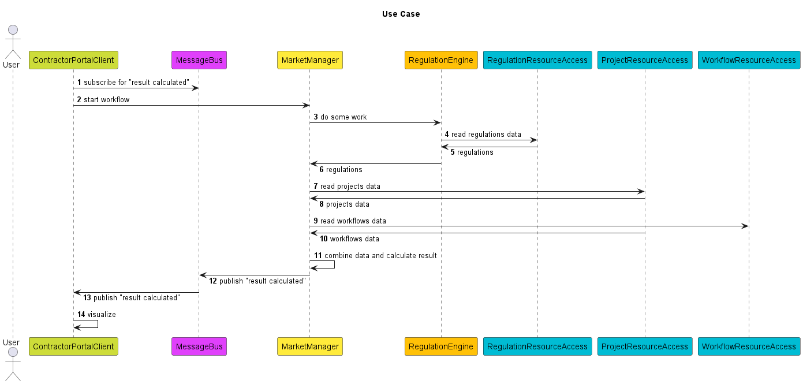

# godefault

[](https://github.com/andygeiss/godefault/blob/main/LICENSE)
[](https://github.com/andygeiss/godefault/releases)
[](https://github.com/andygeiss/godefault)
[](https://goreportcard.com/report/github.com/andygeiss/godefault)
[](https://bettercodehub.com/)

**Generate a standard implementation and tests from your interface declaration**

As a software engineer I often ask myself **"Is it worth the time?"** before I start coding tools.

I found a nice [xkcd](https://xkcd.com/1205/) addressing this issue by "[..] *estimating how long can you work on making a routine task more efficient before you're spending more time than you save.* [..]"

My typical development process is test-driven thus thinking about optimizing my code usually happens during the refactoring phase.
Everytime I start with a simple function and a test and refactor that into structs with methods and an interface.

But if I refactor 50 times per day and each refactoring takes like 30 seconds then I will spend 4 weeks per year for that specific task...

**Table of Contents**

- [Installation](README.md#installation)
- [Steps to start](README.md#steps-to-start)

## Installation

**From Source**

    go install github.com/andygeiss/godefault

## Steps to start

Create a new project and save the following source code into a file `internal/core/core.go`:
```go
package core

import "github.com/andygeiss/utils/message"

//go:generate godefault

type ContractorPortalClient interface {
	Error() (err error)
	WithMessageBus(mb message.Bus)
}

type MarketManager interface {
	Error() (err error)
	WithMessageBus(mb message.Bus)
	WithRegulationEngine(e RegulationEngine) MarketManager
	WithProjectResourceAccess(ra ProjectResourceAccess) MarketManager
	WithWorkflowResourceAccess(ra ProjectResourceAccess) MarketManager
}

type ProjectResourceAccess interface {
	Error() (err error)
}

type WorkflowResourceAccess interface {
	Error() (err error)
}

type RegulationEngine interface {
	Error() (err error)
	WithRegulationResourceAccess(ra RegulationResourceAccess) RegulationEngine
}

type RegulationResourceAccess interface {
	Error() (err error)
}
```

Create and initialize a new module:

    go mod init
    go mod tidy

Finally, generate the default implementation:

    go generate ./...

This will create a PlantUML and ...



Go sources and tests as boilerplate.

    C:.                                              
    |   go.mod                                       
    |   go.sum                                       
    |                                                
    \---internal                                     
        \---core                                     
                core.go                              
                core.puml                            
                defaultContractorPortalClient.go     
                defaultContractorPortalClient_test.go
                defaultMarketManager.go              
                defaultMarketManager_test.go         
                defaultProjectResourceAccess.go      
                defaultProjectResourceAccess_test.go
                defaultRegulationEngine.go           
                defaultRegulationEngine_test.go
                defaultRegulationResourceAccess.go
                defaultRegulationResourceAccess_test.go
                defaultWorkflowResourceAccess.go
                defaultWorkflowResourceAccess_test.go
